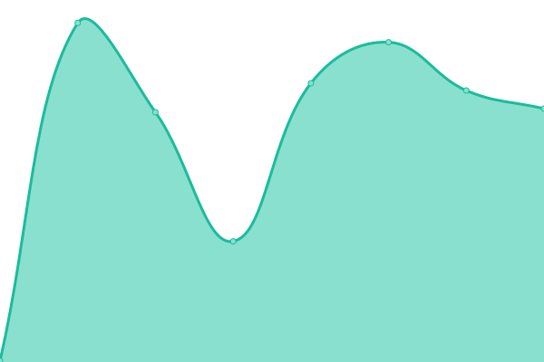

# [📈 Live Status](https://polywoo.github.io/status): <!--live status--> **🟩 All systems operational**

This repository contains the open-source uptime monitor and status page for [Polywoo](https://polywoo.com), powered by [Upptime](https://github.com/upptime/upptime).

With [Upptime](https://upptime.js.org), you can get your own unlimited and free uptime monitor and status page, powered entirely by a GitHub repository. We use [Issues](https://github.com/polywoo/status/issues) as incident reports, [Actions](https://github.com/polywoo/status/actions) as uptime monitors, and [Pages](https://polywoo.github.io/status) for the status page.

<!--start: status pages-->
<!-- This summary is generated by Upptime (https://github.com/upptime/upptime) -->
<!-- Do not edit this manually, your changes will be overwritten -->
<!-- prettier-ignore -->
| URL | Status | History | Response Time | Uptime |
| --- | ------ | ------- | ------------- | ------ |
|  [Polywoo Home](https://polywoo.com) | 🟩 Up | [polywoo-home.yml](https://github.com/polywoo/status/commits/HEAD/history/polywoo-home.yml) | 

 581ms
     
 | 

<a href="https://polywoo.github.io/status/history/polywoo-home">100.00%</a>
    

|  [Polywoo Account](https://account.polywoo.com) | 🟩 Up | [polywoo-account.yml](https://github.com/polywoo/status/commits/HEAD/history/polywoo-account.yml) | 

 231ms
     
 | 

<a href="https://polywoo.github.io/status/history/polywoo-account">100.00%</a>
    

|  [Webapproach Union](https://union.webapproach.net) | 🟩 Up | [webapproach-union.yml](https://github.com/polywoo/status/commits/HEAD/history/webapproach-union.yml) | 

 230ms
     
 | 

<a href="https://polywoo.github.io/status/history/webapproach-union">100.00%</a>
    

<!--end: status pages-->

[**Visit our status website →**](https://polywoo.github.io/status)

## 📄 License

- Powered by: [Upptime](https://github.com/upptime/upptime)
- Code: [MIT](./LICENSE) © [Polywoo](https://polywoo.com)
- Data in the `./history` directory: [Open Database License](https://opendatacommons.org/licenses/odbl/1-0/)
